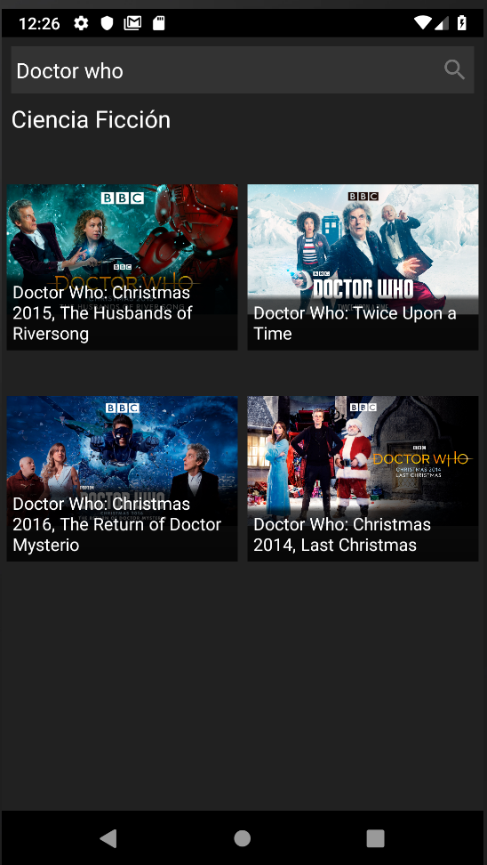

# AppClaroVideo Android

## Introducción

Esta es una app de ejemplo desarrollada en android donde se replican dos vistas de la aplicación web de claro video.

La primera vista  se muestra el catálogo de películas de la sección "Ciencia ficción" y un campo de búsqueda el cual se encarga de filtrar los resultados de la búsqueda.

La segunda vista muestra la información  de la película que fue seleccionada previamente del catálogo anterior.


## Estructura de proyecto
 La estructura del proyecto esta basada en el patron de diseño  MVVM (Modelo-Vista-Modelo de vista) y la librería Retrofit.   

# Librerias

 ## Retrofit 2 
 
 ```implementation 'com.squareup.retrofit2:retrofit:2.5.0'``` 
 
 ```implementation 'com.squareup.retrofit2:converter-gson:2.50'```

 ## Google gson

```implementation 'com.google.code.gson:gson:2.8.5'```

 ## Glide 
 
```implementation 'com.github.bumptech.glide:glide:4.9.0'```

```annotationProcessor 'com.github.bumptech.glide:compiler:4.9.0'```

 ## Butterknife
 
```implementation 'com.jakewharton:butterknife:8.0.1'```

```annotationProcessor 'com.jakewharton:butterknife-compiler:8.0.1'```

 ## Lifecycle
 
 ```implementation "android.arch.lifecycle:extensions:1.1.1"```
 
 ```annotationProcessor "android.arch.lifecycle:compiler:1.1.1"```

# Screenshots





# Instalación

## Requerimientos 
 - API 14: Android 4.0(IceCreamSandwich)
 - Android studio 3.2.1
 - Git
## Instalación en dispositivo móvil 

Descarga el proyecto del repositorio.

```https://github.com/Programmer235/AppClaroVideo.git```

Para instalar en tu dispositivo móvil descarga el apk que se encuentra dentro del proyecto.

```AppClaroVideo/apk/debug/AppClaroVideo/apk/debug/app-debug.apk```

## Cargar proyecto en Android studio

 - Crea un directorio para poder clonar el proyecto desde el repositorio.
 
 - Clona el proyecto desde la terminal con Git.
 
  ```git init
     git add README.md
     git commit -m "first commit"
     git remote add origin https://github.com/Programmer235/AppClaroVideo.git
     git push -u origin master
  ```  
 
 - Abre Android studio y carga el proyecto desde la opción "Open an existing Android Studio project" selecciona 
  el proyecto del directorio donde fue clonado
 

